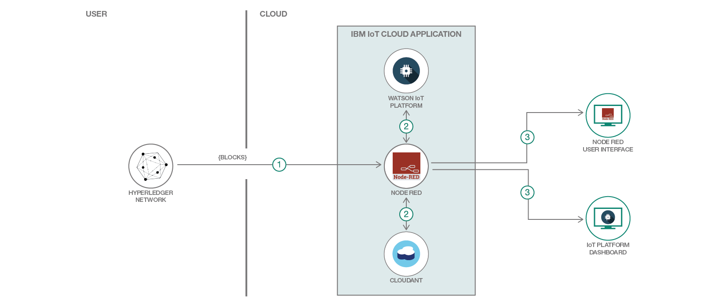
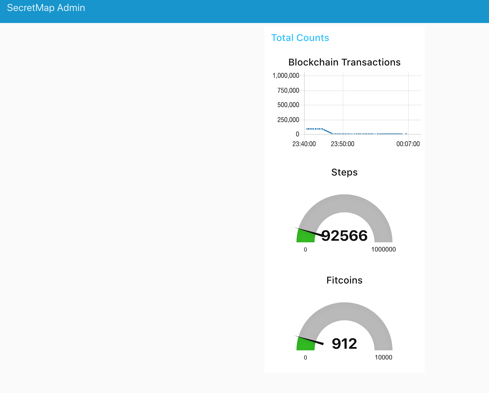
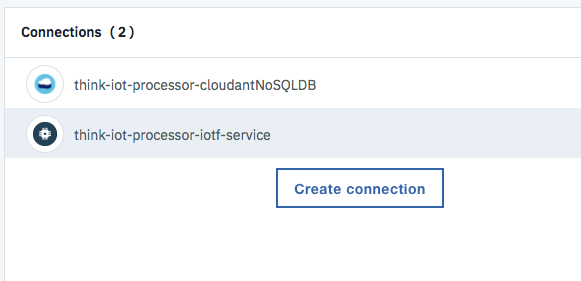
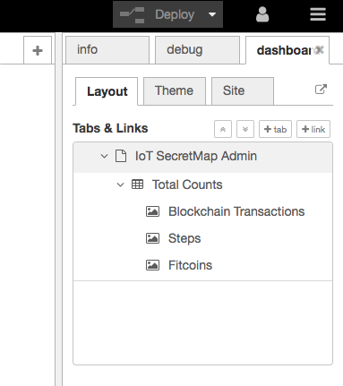
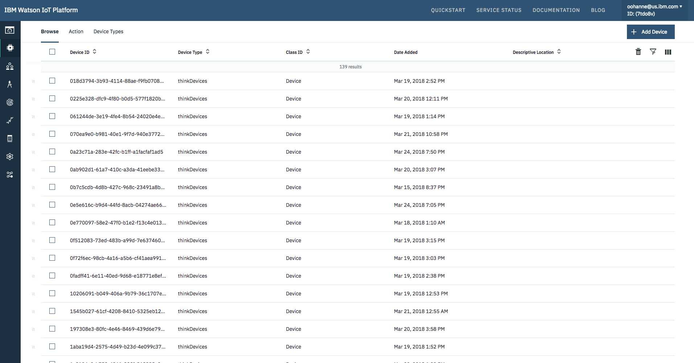

# Using-IOT-toProcess-BlockchainAnalytics

## Introduction
IoT's role in this project will take the users from the Blockchain network and list them as devices on the Watson IoT Platform everytime there's a new user created.

Besides that IoT will simulate a demo device and/or a real device can be chosen to display their data on the platform's dashboard. All these devices in this project will one Device Type.

That's with the Watson IoT Platform, but within Node-Red our IoT app will run analytics to display the total steps and total fitcoins of all users.

The app will also use a graph in real-time to show the Blockchain transactions coming to the IoT whether for new user creation, user validation or for generated values of steps and fitcoins.

## Prerequisites
You will need the following accounts and tools:
* [IBM Cloud account](https://console.ng.bluemix.net/registration/)
* [Blockchain Network Pattern (Optional)](https://developer.ibm.com/code/patterns/explore-hyperledger-fabric-through-a-complete-set-of-apis/)

## Steps of use
Choose from IBM Cloud/Bluemix Catalog the Internet of Things service, name it and create it. After few minutes when your app is ready, open Cloudant and create a database with the name of `secretmap` as seen below in the pic.

Click your app's URL to open your Node-Red editor. Copy in there all the contents from the json file inside the scripts folder and paste them in the import box.

Blockchain Network will pass the blocks where all the information will be taken and be saved to be used for analytics and display the values on the Node-Red dashboard as seen in the above image.

* Make sure to have Cloudant database service available and binded to your Bluemix/IBM Cloud app instance.

* Make sure also to have a Watson IoT Platform created and binded as a service too.

* Dashboard needs to be created in the Node-Red if it's not taken care of by the code import.

* This is how the Node-Red code looks like:

* Watson IoT Platform list of devices preview:

* Values are passed in as json into: `'https://<YOUR-APP-NAME>.mybluemix.net/steps?message=' + blocks`

**Try live demo url:**
> [Demo display](https://think-iot-processor.mybluemix.net/ui/#/0)

# Technology

* [Blockchain](https://developer.ibm.com/code/technologies/blockchain/)
* [Hyperledger Fabric V1.0](https://www.hyperledger.org/projects/fabric?cm_mc_uid=56476701007714999647300&cm_mc_sid_50200000=1501558767)

## Useful links

* [IBM Cloud](https://bluemix.net/)  
* [IBM Cloud Documentation](https://www.ng.bluemix.net/docs/)  
* [IBM Cloud Developers Community](http://developer.ibm.com/bluemix)  
* [IBM Watson Internet of Things](http://www.ibm.com/internet-of-things/)  
* [IBM Watson IoT Platform](http://www.ibm.com/internet-of-things/iot-solutions/watson-iot-platform/)   
* [IBM Watson IoT Platform Developers Community](https://developer.ibm.com/iotplatform/)
* [Node Red](https://nodered.org/)

## License
This code pattern is licensed under the Apache Software License, Version 2. Separate third party code objects invoked within this code pattern are licensed by their respective providers pursuant to their own separate licenses. Contributions are subject to the Developer [Certificate of Origin, Version 1.1 (“DCO”)] (https://developercertificate.org/) and the [Apache Software License, Version 2]( (http://www.apache.org/licenses/LICENSE-2.0.txt).

ASL FAQ link: http://www.apache.org/foundation/license-faq.html#WhatDoesItMEAN
